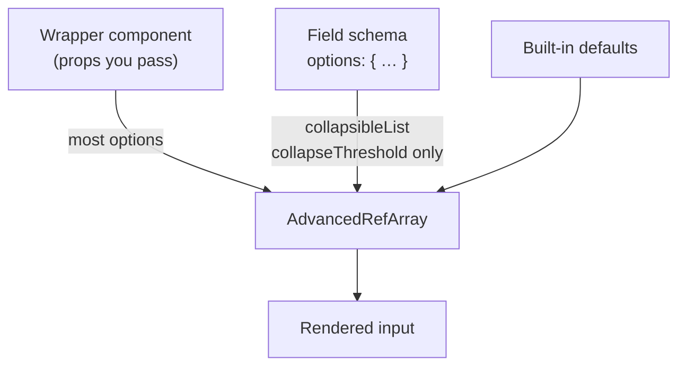
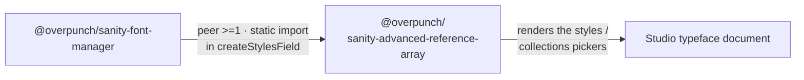

# Sanity Advanced Reference Array

[](https://www.npmjs.com/package/@overpunch/sanity-advanced-reference-array)
[](#-license)
[](#-compatibility)

🚀 **Enhanced reference array component for Sanity Studio with search, sort, and bulk operations**

A powerful, TypeScript-ready component that supercharges Sanity's reference arrays with advanced search capabilities, intelligent sorting, and intuitive bulk operations. Built from real-world usage in production Sanity studios.

Drop it onto any `array` of `reference` fields as a custom `input` component. Editors get a live search box that adds documents with a single click (or all at once), a sort mode that reorders the array by any field on the referenced documents, and a guarded "remove all". Everything is written back through normal Sanity patches, so the stored value stays a plain reference array.

## 🎥 **See It In Action**

https://github.com/user-attachments/assets/bb53e81b-4475-4510-bd86-452b954e3d2c

*Watch the Advanced Reference Array in action - featuring smart search, click-to-add functionality, bulk operations, and dynamic sorting.*

## ✨ Features

### 🔍 **Smart Search**


- **Live GROQ queries** with debounced search
- **Smart filtering** - automatically hides items already in your array
- **Individual click-to-add** - click any search result to add it instantly
- **Bulk "Add All"** - add multiple items at once
- **Keyboard shortcuts** - `Ctrl+Enter` to add all, `Escape` to clear search

### 🎯 **Dynamic Sorting**


- **Sort by any field** in your referenced documents
- **Visual sort indicators** - see if your list is already sorted
- **Toggle sort direction** - ascending/descending with one click
- **Browser compatible** - works across all modern browsers

### 🛡️ **Safety & UX**


- **Danger mode** - prevents accidental bulk deletions
- **Confirmation dialogs** for destructive operations
- **Loading states** and error handling
- **Responsive design** - works on mobile and desktop
- **Accessibility ready** - keyboard navigation support

### ⚡ **Performance**
- **Debounced search** - no unnecessary API calls
- **Smart caching** - efficient data fetching
- **TypeScript support** - full type safety
- **Collapsible list** - long arrays auto-collapse so the form stays navigable

## 📦 Installation

```bash
npm install @overpunch/sanity-advanced-reference-array
```

Peer dependencies (`sanity`, `react`, `@sanity/ui`, `@sanity/icons`) are already present in any Sanity Studio — see [Compatibility](#-compatibility).

## 🚀 Quick Start

Attach the component as the `input` for an array of references. No configuration is required — the defaults are the behaviour shown in the video above.

```typescript
import { defineType, defineField } from 'sanity'
import { AdvancedRefArray } from '@overpunch/sanity-advanced-reference-array'

export const myDocument = defineType({
  name: 'myDocument',
  type: 'document',
  fields: [
    defineField({
      name: 'relatedItems',
      title: 'Related Items',
      type: 'array',
      of: [
        { type: 'reference', to: [{ type: 'product' }, { type: 'article' }] },
      ],
      components: {
        input: AdvancedRefArray,
      },
    }),
  ],
})
```

### Data shape

The stored value is an ordinary Sanity reference array — this component changes the *editing experience*, not the data. Sorting rewrites the array order; nothing else about the shape changes.

```json
"relatedItems": [
  { "_type": "reference", "_key": "a1b2c3d4", "_ref": "product-oxford" },
  { "_type": "reference", "_key": "e5f6g7h8", "_ref": "article-on-serifs" }
]
```

Query it exactly as you would any reference array:

```groq
*[_type == "myDocument"]{
  relatedItems[]->{ _id, title }
}
```

## ⚙️ Configuration

> **Read this before copying a config example.** There are two different mechanisms, and most options only work through one of them.

Sanity passes a fixed set of props to a custom `input` component — you **cannot** pass arbitrary settings through the field's `options` object and have them arrive as props. So this component reads its configuration from two places:



Resolution order for the two schema-readable options is **explicit prop → schema `options` → default**. Every other option is prop-only.

### Configure via a wrapper (the general case)

Wrap the component to bind props, then use the wrapper as your `input`:

```typescript
import { defineType, defineField } from 'sanity'
import { AdvancedRefArray } from '@overpunch/sanity-advanced-reference-array'

// Bind options once, reuse across fields
const CuratedRefArray = (props) => (
  <AdvancedRefArray
    {...props}
    maxSearchResults={20}
    searchPlaceholder="Search products..."
    allowBulkAdd={false}
    showItemCount={false}
  />
)

export const collection = defineType({
  name: 'collection',
  type: 'document',
  fields: [
    defineField({
      name: 'featuredItems',
      type: 'array',
      of: [{ type: 'reference', to: [{ type: 'article' }] }],
      components: { input: CuratedRefArray },
    }),
  ],
})
```

### Configure via schema `options` (collapse only)

```typescript
defineField({
  name: 'relatedItems',
  type: 'array',
  of: [{ type: 'reference', to: [{ type: 'product' }] }],
  components: { input: AdvancedRefArray },
  options: {
    collapsibleList: true,    // read from schema options
    collapseThreshold: 10,    // read from schema options
  },
})
```

### Option reference

| Option | Type | Default | Settable via | What it does |
|---|---|---|---|---|
| `searchPlaceholder` | `string` | `'Find items to add...'` | prop | Placeholder text for the search input |
| `allowIndividualAdd` | `boolean` | `true` | prop | Click a search result to add it |
| `allowBulkAdd` | `boolean` | `true` | prop | Show the "Add All" button |
| `filterExisting` | `boolean` | `true` | prop | Hide results already in the array |
| `maxSearchResults` | `number` | `50` | prop | Slice applied to the search query |
| `showItemCount` | `boolean` | `true` | prop | Show result counts under the list |
| `enableKeyboardShortcuts` | `boolean` | `true` | prop | `⌘/Ctrl+Enter` add all, `Escape` clear |
| `filterGroq` | `string` | — | prop | Extra GROQ condition appended to the search with `&&` |
| `filterParams` | `(document) => object` | — | prop | Returns GROQ params derived from the current document |
| `collapsibleList` | `boolean` | `true` | **prop or schema `options`** | Enable the collapse/expand toggle |
| `collapseThreshold` | `number` | `20` | **prop or schema `options`** | Auto-collapse once the array exceeds this many items |

### Document-scoped search with `filterGroq` / `filterParams`

The most powerful pairing: narrow the search to documents related to the one being edited. `filterParams` receives the current document and returns GROQ parameters; `filterGroq` is appended to the search condition.

```typescript
// Only offer fonts that belong to the typeface currently being edited
const typefaceParams = (doc) => ({ typefaceName: doc?.title || '' })

const FontsRefArray = (props) => (
  <AdvancedRefArray
    {...props}
    filterGroq="lower(typefaceName) == lower($typefaceName)"
    filterParams={typefaceParams}
  />
)
```

This is exactly how [`@overpunch/sanity-font-manager`](https://www.npmjs.com/package/@overpunch/sanity-font-manager) scopes its font pickers.

### How search and sort actually resolve fields

Two behaviours worth knowing, because they are automatic rather than configured:

- **Search matches the `title` field only.** The generated query is
  `*[_type in $types && title match $search][0...maxSearchResults]`. Referenced documents therefore need a `title` to be findable. There is **no `searchFields` option** — searching additional fields is not currently implemented.
- **Sortable fields are auto-discovered.** On entering sort mode the component expands the referenced documents and offers every non-underscore-prefixed key of the first result as a sort field. There is **no `sortableFields` option** — the list comes from your data.

> Earlier drafts of this README documented `searchFields` and `sortableFields` options. They were never implemented; the behaviour above is what ships. Both remain reasonable feature requests — see [Contributing](#-contributing).

## 🎯 Real-World Examples

### E-commerce Product Relations
```typescript
// Perfect for related products, cross-sells, upsells
const ProductRefArray = (props) => (
  <AdvancedRefArray {...props} maxSearchResults={20} searchPlaceholder="Search products..." />
)

defineField({
  name: 'relatedProducts',
  title: 'Related Products',
  type: 'array',
  of: [{ type: 'reference', to: [{ type: 'product' }] }],
  components: { input: ProductRefArray },
})
```

### Content Collections
```typescript
// Great for curated article collections, featured content.
// Curated content should be added individually, so bulk add is off.
const CuratedArticles = (props) => (
  <AdvancedRefArray {...props} allowBulkAdd={false} filterExisting />
)

defineField({
  name: 'featuredArticles',
  title: 'Featured Articles',
  type: 'array',
  of: [{ type: 'reference', to: [{ type: 'article' }] }],
  components: { input: CuratedArticles },
})
```

### Team & Author Management
```typescript
// Perfect for assigning multiple team members, contributors
const PeopleRefArray = (props) => (
  <AdvancedRefArray {...props} searchPlaceholder="Search team members..." />
)

defineField({
  name: 'contributors',
  title: 'Contributors',
  type: 'array',
  of: [{ type: 'reference', to: [{ type: 'person' }] }],
  components: { input: PeopleRefArray },
  options: { collapseThreshold: 15 },
})
```

## 🔗 Relationship to `sanity-font-manager`

This package is a **required peer dependency** of [`@overpunch/sanity-font-manager`](https://www.npmjs.com/package/@overpunch/sanity-font-manager) (declared as `">=1"`).

`sanity-font-manager` imports `AdvancedRefArray` at the top level of its `createStylesField` schema module, which its package entry re-exports. That is a **static ESM import**, so if this package is not installed, importing *anything* from `sanity-font-manager` throws at module load — the failure looks like a Studio that will not boot, not a missing-feature warning.



If you use the font manager, install both:

```bash
npm install @overpunch/sanity-font-manager @overpunch/sanity-advanced-reference-array
```

This package is also useful entirely on its own — it has no dependency on the font manager.

## 🧩 Compatibility

Supports **Sanity Studio v3, v4, v5 and v6** from a single build.

| Package | Supported range |
|---|---|
| `sanity` | `>=3 <7` (Studio v3 – v6) |
| `react` | `>=18` |
| `@sanity/ui` | `>=2 <5` |
| `@sanity/icons` | `>=2 <6` |

### How one build spans four majors

The peer ranges look inconsistent at a glance, so here is the reasoning:

- **`@sanity/ui` v4 moved components to subpath entries.** `Tooltip`, `Menu`, `MenuButton`, `MenuItem`, `Code`, `Popover`, `Autocomplete`, `Toast` and `useToast` are no longer on the package root.
- **`@sanity/icons` v5 removed every named `*Icon` export.**
- **Both still *declare* the removed names in their `.d.ts`, typed `never`.** A named import therefore type-checks, compiles, and only then fails at runtime — the breakage is invisible to `tsc` and to a green build.
- **So this package imports no `@sanity/ui` or `@sanity/icons` symbol directly.** Everything routes through [`@overpunch/sanity-ui-compat`](https://www.npmjs.com/package/@overpunch/sanity-ui-compat) (a real runtime dependency, installed for you), which resolves the installed namespace at runtime and works against either layout.

**The `@sanity/ui` peer is `>=2 <5`, and that is correct for Sanity v6** — Studio v6 ships `@sanity/ui` **v4**, not v5. It is not a stale upper bound.

### Verification status

v3 – v6 support is established by the declared peer ranges, green builds, and the runtime-resolving compat layer. Beyond that, this component has been exercised in **three in-house Studios**. It has **not** been broadly tested in a running Sanity 6 Studio outside those. Please [open an issue](https://github.com/over-punch/sanity-advanced-reference-array/issues) if you hit a version-specific problem.

### Packaging

- Ships **CJS** (`dist/index.js`) and **ESM** (`dist/index.esm.js`) with bundled **TypeScript declarations** (`dist/index.d.ts`) and source maps.
- Uses the Studio client via `useClient({ apiVersion: '2023-01-01' })`, so it must render inside a Sanity Studio React tree.

### A note on GROQ interpolation

`filterGroq` and `maxSearchResults` are interpolated directly into the generated GROQ query. They are intended to come from **trusted schema/wrapper configuration only** — never wire them to end-user input. Search text itself is correctly passed as a bound `$search` parameter.

## 🔧 Development

```bash
# Clone the repository
git clone https://github.com/over-punch/sanity-advanced-reference-array.git

# Install dependencies
npm install

# Build the package
npm run build

# Run type checking
npm run type-check

# Run linting
npm run lint
```

## 🤝 Contributing

We welcome contributions! This component was built from real-world usage across multiple Sanity studios and continues to evolve based on community needs.

### Areas for Contribution:
- 🐛 **Bug fixes** - Help us squash issues
- ✨ **Feature requests** - Suggest new capabilities (configurable `searchFields` and `sortableFields` are both open ideas)
- 📚 **Documentation** - Improve examples and guides
- 🧪 **Testing** - Add test coverage
- 🎨 **UI/UX** - Enhance the user experience

## 📄 License

MIT © [Quinn Keaveney](https://github.com/quitequinn)

## 🙏 Acknowledgments

This component combines the best features from multiple implementations used in production Sanity studios:
- **Darden Studio** - Original advanced search and sort functionality
- **The Designer's Foundry** - Individual item selection and UX improvements
- **Community feedback** - Ongoing enhancements and bug fixes

## 🔗 Links

- [NPM Package](https://www.npmjs.com/package/@overpunch/sanity-advanced-reference-array)
- [GitHub Repository](https://github.com/over-punch/sanity-advanced-reference-array)
- [`@overpunch/sanity-font-manager`](https://www.npmjs.com/package/@overpunch/sanity-font-manager) - depends on this package
- [`@overpunch/sanity-ui-compat`](https://www.npmjs.com/package/@overpunch/sanity-ui-compat) - the v3–v6 compatibility layer
- [Sanity.io](https://www.sanity.io/)
- [Report Issues](https://github.com/over-punch/sanity-advanced-reference-array/issues)

---

**Made with ❤️ for the Sanity community**

*Transform your reference arrays from basic lists into powerful, searchable, sortable content management tools.*
